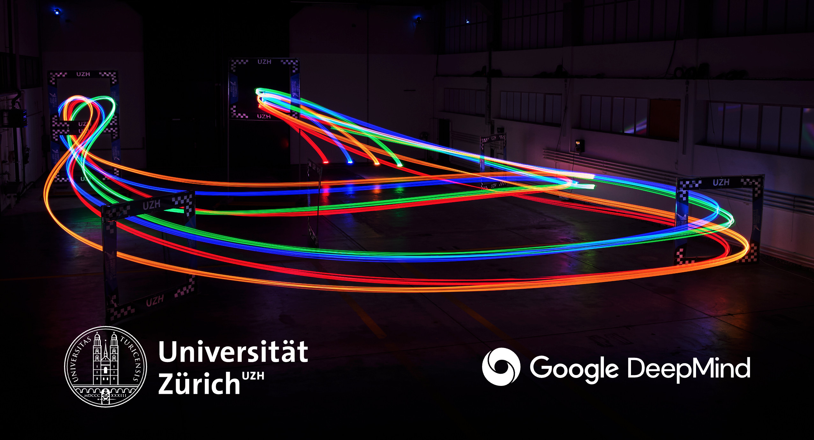

# Superhuman Safe and Agile Racing through Multi-Agent Reinforcement Learning

[](https://rpg.ifi.uzh.ch/marl/)
[](https://arxiv.org/abs/2605.22748)
[](https://youtu.be/dumWP-cwE3w)

[](https://youtu.be/dumWP-cwE3w)

Training and headless evaluation for multi-agent drone racing, with **SA, IPPO,
SP, LP and LP-MLP**. Requires access to Agilicious internal; follow the
access-request instructions in the [Agilicious repository](https://github.com/uzh-rpg/agilicious).

## Installation

Use Linux, Python 3.9, CMake, a C++17 compiler, OpenMP and Eigen 3.4 headers.
Run from this folder, with Agilicious in a separate checkout:

```bash
git clone git@github.com:uzh-rpg/agilicious_internal.git ../agilicious_internal
git -C ../agilicious_internal checkout 02696bc1d5a97d8aed5a3e9fb7bdaf381c6b6041
python3.9 -m venv .venv
source .venv/bin/activate
bash setup.sh ../agilicious_internal
```

Setup applies the simulator patch and builds locally. Dependencies go in
`.deps/`; compiled files go in `build/`.

## Training

```bash
bash run.sh train lp --output runs/lp
```

Choose `sa`, `ippo`, `sp`, `lp` or `lp_mlp`.
For a short training check, add
`--num-envs 2 --threads 1 --steps 4 --epochs 1 --timesteps 16 --device cpu`.

## Evaluation

```bash
bash run.sh evaluate --controllers lp,lp_mlp,sa,ippo --output runs/mixed
bash run.sh benchmark self --output runs/self --workers 4 --plot
bash run.sh benchmark pool --output runs/pool --workers 4
```

Self evaluation repeats each checkpoint across 1–8 agents and 64 starts.
Pool evaluation samples 1,000 four-agent lineups with equal method probability,
then evaluates 64 starts each. Use `--starts 1` for fewer starts,
`--lineups 1` for a single pool lineup, or `--agents 4` to restrict self races.

`--plot` overlays each lineup's races with a different color per agent start
slot. To plot existing results, run `bash run.sh plot runs/self`.
Race outputs are in `races/`, logs in `logs/`, and summaries and plots at the top level.

Races run at 50 Hz for at most 20 s; completion requires 22 gate passages.
`summary.csv` reports completion, gate fraction, rank, collisions and the mean
of each participant's best completed simulator lap. Raw results retain
corrected flying laps and trajectories.
Downwash is stochastic and is not fully controlled by the evaluation seed.
Rankings use deterministic ties, finishing order and frozen crash progress.

## Checkpoints

Each method has four evaluated checkpoints: `checkpoints/SA/1.pth`–`4.pth`,
with the same layout for `SP`, `LP` and `LP-MLP`. IPPO uses `A0.pth`–`A3.pth`
for its four agents. Extra fixed training opponents comprise 3 SA policies in
`SA/training/` and 12 IPPO policies in `IPPO/training/`, named `1_a0.pth` through
`3_a3.pth` (checkpoint number and agent). The 35
weight files include all evaluated policies and the opponents needed for
LP/LP-MLP training.

## License

[GPLv3](LICENSE). See [NOTICE.md](NOTICE.md) for third-party licenses.

## Citation

If you use this code, please cite:

```bibtex
@misc{geles2026superhumanmultiagentracing,
  title={Superhuman Safe and Agile Racing through Multi-Agent Reinforcement Learning},
  author={Ismail Geles and Leonard Bauersfeld and Markus Wulfmeier and Davide Scaramuzza},
  year={2026},
  eprint={2605.22748},
  archivePrefix={arXiv},
  primaryClass={cs.RO},
  url={https://arxiv.org/abs/2605.22748},
}
```
